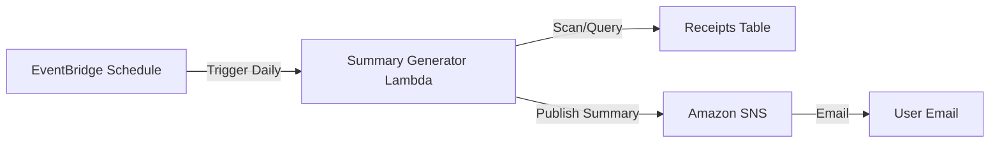

# Notifications & Reporting: AWS SNS + Lambda

This document details how to set up a **Daily Account Summary** system using Serverless architecture. This feature sends users a daily email summarizing their expenses.

## 1. Architecture Flow



## 2. Setup Guide

### Step 1: Create Amazon SNS Topic
1.  Go to the **Amazon SNS Console**.
2.  Click **Topics** -> **Create topic**.
3.  **Type**: Standard.
4.  **Name**: `receipt-summary-topic`.
5.  **Create subscription**:
    *   Protocol: **Email**.
    *   Endpoint: Your email address.
    *   **Important**: Check your inbox and confirm the subscription.

### Step 2: Create Lambda Function
1.  Go to **AWS Lambda Console** -> **Create function**.
2.  **Name**: `ReceiptSummaryGenerator`.
3.  **Runtime**: Python 3.12.
4.  **Code**: Use the script below.

```python
import boto3
import os
import datetime
from boto3.dynamodb.conditions import Key

# Config
TOPIC_ARN = os.environ['SNS_TOPIC_ARN']
TABLE_NAME = os.environ['DYNAMODB_TABLE']

sns = boto3.client('sns')
dynamodb = boto3.resource('dynamodb')
table = dynamodb.Table(TABLE_NAME)

def lambda_handler(event, context):
    # Calculate date range (e.g., yesterday)
    today = datetime.date.today()
    # For a daily report, you might filter by date here
    
    # Scan/Query for user receipts (Simplified for demo)
    # In production, use GSI 'user-index' to query specific users
    response = table.scan()
    items = response.get('Items', [])
    
    total_spent = sum(float(item['total']) for item in items)
    count = len(items)
    
    message = (
        f"📊 Daily Expense Summary\n"
        f"------------------------\n"
        f"Date: {today}\n"
        f"Transactions Analyzed: {count}\n"
        f"Total Spent: ${total_spent:.2f}\n\n"
        f"Log in to your dashboard for details."
    )
    
    # Publish to SNS
    sns.publish(
        TopicArn=TOPIC_ARN,
        Subject="Your Daily Receipt Summary",
        Message=message
    )
    
    return {"status": "success", "sent": True}
```

### Step 3: Permissions (IAM)
The Lambda Execution Role must have:
*   `dynamodb:Scan` / `dynamodb:Query` on your table.
*   `sns:Publish` on your SNS topic.

### Step 4: Schedule with EventBridge
1.  Go to **Amazon EventBridge** -> **Schedules**.
2.  Create Schedule.
3.  **Pattern**: Recurring schedule (Cron).
4.  **Cron Expression**: `0 9 * * ? *` (Runs daily at 9 AM UTC).
5.  **Target**: Select your Lambda function (`ReceiptSummaryGenerator`).

---

## 3. Environment Variables
Add these to your Lambda Configuration:
*   `SNS_TOPIC_ARN`: `arn:aws:sns:us-east-1:123456789012:receipt-summary-topic`
*   `DYNAMODB_TABLE`: `your-dynamodb-table-name`
